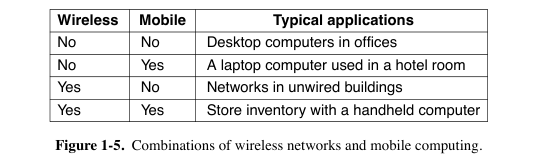
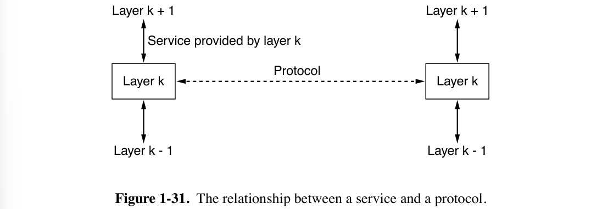
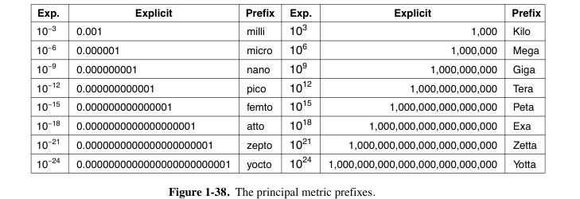

# 1: Introduction

!!! warning "警告"
    前半部分仅删改小角龙笔记；因为很容易出概念题，后半部分摘录书上原文，作为补充。

## 小角龙

### 1.1 网络模型

- OSI 七层模型：三个重要概念：服务，接口和协议
    - 物理层：在一条通信信道上传输比特
        - 要确定用什么电子信号表示0和1，一个比特持续多久，传输是否可以双向，连接如何建立等等
    - 数据链路层：发送方将输入数据拆分成若干数据帧(frame)，然后按照一定的顺序来发送这些数据帧
        - 接收方必须确认收到的每一帧，保证数据的顺序和完整性，然后发回确认帧
        - 为了防止发送方淹没慢速的接收方，需要对流量进行调节
        - **介质访问控制子层**则是控制对共享信道的访问，没有拥塞控制的功能
    - 网络层：控制子网的运行，将数据包从源端发送到接收方，需要处理拥塞
        - 允许异构的网络相互连接成互联网络
    - 传输层：接受会话层的数据，将数据分割成小单元，然后传到网络层
        - 传输层是真正的端到端的层，始终将源数据从源端带到接收方
        - OSI模型中1-3层是链式连接的，而4-7层是端到端的
    - 会话层：负责管理主机间的会话进程，利用传输层提供的端到端的服务，向表示层提供增值服务，主要表现为**表示层实体或者用户进程**建立连接并在连接上传输数据
        - 这一过程也称为建立同步
    - 表示层：关注传递信息的语法和语义，主要是实现数据的格式转换和压缩
    - 应用层：包含了各种各样的协议，提供了用户和网络的接口
        - 软件开发基本都是应用层的工作
        
- TCP/IP
    - 原本是Linux/Unix下的一个网络通信栈，比较OSI七层模型简单
    - **没有表示层和会话层**，物理层和数据链路层Host-to-network
    - 因为开放，所以用的人多，所以成为了互联网的标准
- 混合模型 hybrid model：本课程讨论的模型
    - 物理层
    - 数据链接层
    - 网络层：可能分为内层和外层
    - 传输层
    - 应用层

### 1.2 协议架构

- 数据传输的过程：
    - 在source machine中，数据自顶向下传输，每一层会给上一层传输的数据包添加一个header，如果传输的数据包过大则会把数据包进行拆分，但是**header不会进行拆分** 
    - 在destination machine中，则一步步去掉底层的header，并将小的数据包合并

### 1.3 服务 Service

- 服务类型

    - 面向连接的服务 connection-oriented
        - Reliable message stream 可信信息流，比如page的序列
        - Reliable byte stream 可信字节流，比如远程登录，TCP/IP协议向应用层发送的是字节流
        - Unreliable connection 不可信连接，比如数字化语音
    - 不需要连接的服务 connection-less
        - Unreliable datagram 不可信数据报，比如垃圾邮件
        - Acknowledged datagram 共识数据包，比如注册邮件
        - Request-reply 请求回复，比如数据库查询
    - QoS 服务的质量

- 服务原语 Service Primitives

    - 面向连接服务的5个服务原语

    | Primitive    | Meaning                                        |
    | ---------- | -------------------------- |
    | LISTEN         | 等待一个还没来的连接             |
    | CONNECT        | 和一个等待的对等层进行连接 |
    | RECEIVE        | 等待一个还没来的message        |
    | SEND             | 向对等层发送一个message        |
    | DISCONNECT | 结束一个连接                             |

    - Request--Indication--Response--Confirm

### 1.4 C/S模式

- Client-Server Model 客户端主动连接，服务端被动连接
    - 客户端之间不能直接通信，客户端的通信也需要经过服务器
    - 新技术：服务器分配端口，让两个客户端直接通信，不需要所有数据经过服务器
    - 当客户端升级的时候需要更新整个客户端，手机APP就是C/S模式
- Browser-Server Model 从C/S体系发展而来
    - 通过浏览器来实现用户和服务端的交互，只需要升级浏览器
- Peer-to-peer Model(P2P模式)——对等网络
    - 每个客户端同时又是服务端，没有固定的客户端和服务端

- wireless network 无线网络
    - 注意和移动计算mobile computing的区别，移动计算可以是有线的，可以是无线的
    - wifi就是一种无线网络

### 1.5 网络传输

- 三种传输方式：
    - Broadcast links 广播式传输
        - 传输模型类似于**总线**，总分式结构
        - 以太网的原理都是基于广播的
    - Point-to-point links 点对点传输
        - 传输模型是一张复杂的网——网络拓扑结构
        - 一次只发给一台计算机
    - multicasting 多点广播
        - 传输模型是一个环，一次发给一组计算机
        - 不是天然存在的，需要通过软件系统来实现多点广播机制
- 网络的类型：按照规模来划分
    - 个人区域网 Personal area network(PAN)
    - 局域网 Local area network(LAN)
    - 层域网Metropolitan area network(MAN)
        - 技术的可替代性比较强，局域网大一点就可以作为层域网，广域网小一点就可以作为层域网
    - 广域网Wide area network(WAN)
        - 特点是会有很多router和subnet
    - 最大的网络就是因特网 The Internet

---

## 原文摘录

### 1.1

**Computer network** means a collection of interconnected, autonomous computing devices.

**Internet** is the most well-known example of a network of networks.

The **client-server model** is widely used and forms the basis of much network
usage. The most popular realization is that of a **Web application**, where a server generates Web pages based on its database in response to client requests that may update the database.

Another popular model for accessing information is **peer-to-peer communication**. Every person can, in principle, communicate with one or more other people; there is no fixed division into clients and servers.

**Ubiquitous computing** entails computing that is embedded in everyday life.

Devices such as televisions can use **power-line networks** to send information throughout the house over the wires that carry electricity.

### 1.2

计算机网络的主要种类包含 **Broadband Access Networks** 和 **Mobile and Wireless Access Networks**。

Wireless network

- **Cellular networks** operated by telephone companies 
- **Wireless hotspots** based on the 802.11 standard

Although wireless networking and mobile computing are not identical: **fixed wireless** and **mobile wireless** networks. 

**Smartphones** combine aspects of mobile phones and mobile computers, connect to wireless hotspots and automatically switch between networks to choose the best option for the user. 

- **Text messaging** or texting (**SMS Short Message Service**) over the cellular network was popular.
- Mobile phones are being increasingly used in **m-commerce** (mobile-commerce).
    - Equipped with **NFC (Near Field Communication)**, the mobile can act as an RFID smartcard and interact with a nearby reader for payment.
- **GPS (Global Positioning System)** can directly locate a device, and mobile phones often also triangulate between Wi-Fi hotspots with known locations to determine their location. **geo-tagging**

**Sensor networks** have nodes that gather and relay information they sense about the state of the physical world. 

Modern **data center networks** have hundreds of thousands or millions of servers in a single location, serving **cloud computing** and are designed to move large amounts of data between servers in the data center / between the data center and the rest of the Internet.

**CDN (Content Delivery Network)** is a large collection of servers that are geographically distributed in such a way that content is placed as close as possible to the users that
are requesting it.

When the content provider and your **ISP (Internet Service Provider)** are not directly connected, they often rely on a **transit network** to carry the traffic between them. Transit networks are traditionally called **backbone networks** because they have had the role of carrying traffic between two endpoints. 

Networks called **VPNs (Virtual Private Networks)** connect the individual networks at different sites into one logical network.

A computer network can provide a powerful **communication medium** among employees.

Telephone calls between employees may be carried by the computer network instead of by the phone company, this is called **IP telephony** or **VoIP (Voice over IP)**.

**Desktop sharing** lets remote workers see and interact with a graphical computer screen.

### 1.3

**PANs (Personal Area Networks)** let devices communicate over the range of a person. A common example is a wireless network that connects a computer with its peripherals.

A **LAN (Local Area Network)** is a private network that operates within and nearby a single building.

In wireless LANs (**IEEE 802.11**), each computer talks to a device called an **AP (Access Point), wireless router, or base station**.

Another common scenario entails nearby devices relaying packets for one another in a so-called **mesh network** configuration. In some cases, the relays are the same nodes as the endpoints, more commonly, a mesh network will include a separate collection of nodes whose sole responsibility is relaying traffic.

Many wired LANs comprise point-to-point wired links. **IEEE 802.3**, popularly called **Ethernet**, is by far the most common type of wired LAN.

- A switch has multiple **ports**, each of which can connect to one other device, such as a computer or even another switch.

A **MAN (Metropolitan Area Network)** covers a city. The best-known examples of MANs are the cable television networks.

- Both television signals and Internet are fed into the centralized **cable head-end**.

A collection of interconnected networks is called an **internetwork or internet**. We will use these terms in a generic sense, in contrast to the global **Internet** (which is one specific internet).

The device that connects two or more networks and provides the necessary translation, both in terms of hardware and software, is a **gateway**.

### 1.5

#### 1.5.1 Design Goals

Reliability

- error detection & correction
- routing: finding a working path through a network

Resource Allocation

- Designs that continue to work well when the network gets large are said to be **scalable**.
- **statistical multiplexing**: sharing based on the statistics of demand.
- **flow control**: Feedback from the receiver to the sender.
- **congestion**: the network is oversubscribed because too many computers want to send too much traffic.
- **real-time** delivery
- **Quality of service (QoS)** is the name given to mechanisms that reconcile these competing demands.

Evolvability

- **protocol layering**: the key structuring mechanism used to support change by dividing the overall problem and hiding implementation details.
- **addressing (in low layers) or naming (in high layers)**: identifying the senders and receivers that are involved in a particular message.
- **internetworking**: number messages & disassembling, transmitting, and then reassembling messages.

Security

- **confidentiality**: defend eavesdropping on communications
- **authentication**: prevent someone from impersonating someone else
- **integrity**: prevent surreptitious changes to messages

#### 1.5.2 Protocol Layering

To reduce their design complexity, most networks are organized as a stack of **layers or levels**.

A **protocol** is an agreement between the communicating parties on how communication is to proceed.

The entities comprising the corresponding layers on different machines are called **peers**, may be software processes, hardware devices, or even human beings. 

- peers communicate by using the protocol.

Between each pair of adjacent layers is an **interface**, it defines which primitive operations and services the lower layer makes available to the upper one.

A set of layers and protocols is called a **network architecture**.

A list of the protocols used by a certain system, one protocol per layer, is called a **protocol stack**.

#### 1.5.3 Connections and Reliability

**Connection-oriented service**: when a connection is established, the sender, receiver, and subnet conduct a **negotiation** about the parameters to be used. 

- A circuit is another name for a connection with associated resources, such as a fixed bandwidth.

**Connectionless service**: Each message carries the full destination address, and each one is routed through the intermediate nodes inside the system independent of all the subsequent messages.

- **store-and-forward switching**: the intermediate nodes receive a message in full before sending it on to the next node. 
- **cut-through switching**: the onward transmission of a message at a node starts before it is completely received by the node.

**acknowledged datagram service**: Used when not having to establish a connection to send one message is desired, but reliability is essential. It is like sending a registered letter and requesting a return receipt.

**request-reply service**: the sender transmits a single datagram containing a request; the reply contains the answer. client-server model.

### 1.6

OSI失败的原因：Bad Timing、Bad Design、Bad Implementations、Bad Politics

### 1.9

