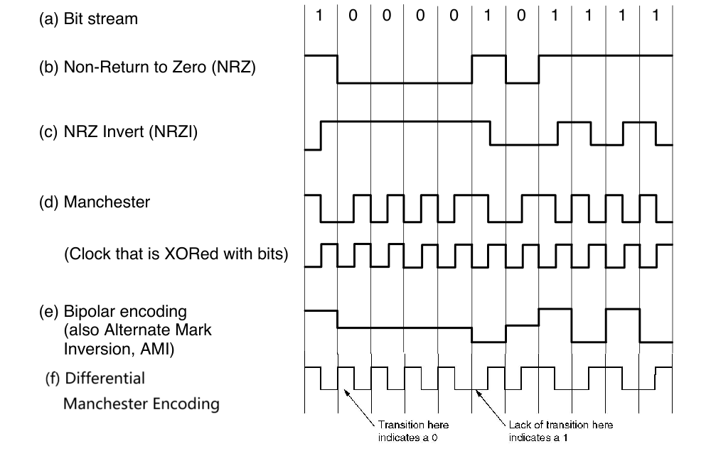
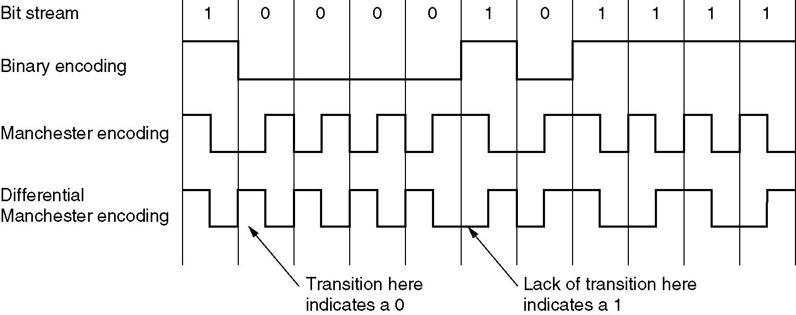

# 2: Physical Layer

## 2.0 物理层的基本概念

- 物理层存在的意义正是要尽可能地屏蔽不同的传输媒体和通信手段之间的差异，使得物理层上面的数据链路层感受不到这些差异
    - 物理层的协议也常常称为procedure（规程）
- 一个数据通信系统分为如下几个部分
    - 源系统，也叫发送端和发送方：包含源点和发送器
    - 传输系统，也叫传输网络
    - 目的系统，也叫接收端，包含接收器和重点

## 2.1 有线通信和无线通信

- 物理层用到的几种线
    - Twisted Pair（双绞线）
        - 双绞合可以减少对相邻导线的干扰。外部无金属网屏蔽层的双绞线称UTP，否则为STP。
        - 最早的双绞线标准是Cat 3（三类线）。Cat 5 是UTP，绞合密度更高，传播举例远，适用于100-Mbps和1-Gbps的以太网局域网。
        - Cat 6（UTP）和Cat 7（对双绞线上以及整个电缆都有屏蔽）速度更快，支持10-Gbps链路。Cat 8（八类线）的运行速度比低类别更快，但只能在约30米的短距离内运行，兼容Cat 8标准有两个选项：Class I兼容Cat 6A，Class II兼容Cat 7A
        - 双绞线的传输距离有限（几十km），模拟传输需要放大器，数字传输需要中继器对信号进行整形。
    - Coaxial Cable（同轴电缆）
    - Fiber Cables（光缆）
        - 利用了光的全反射原理，在特定入射角度下不会发生折射
        - 多模光纤（multi-mode fiber）的直径较大，光源是发光二极管，因此可能同时有多个入射角的信号在其中传播，随着传输距离增大，不同入射角的光线的光程差逐渐拉大，因此脉冲会展宽、失真。
        - 单模光纤（single-mode fiber）的直径只有一个光的波长左右，这时候光线可以一直向前传输，而无需多次反射。光源是半导体激光器（semiconductor laser），因此传输中衰减较小。
        - 为了不让光纤太细，一般单模光纤中的光的波长要长一点。
        - 在光纤连接方法中，fuse（熔接）的信息损失较小。
        - 光纤的优点是带宽高，低衰减（损耗小距离高），抗电磁干扰，体积小重量轻，安全性好不易被窃听。
- Interface Line（接口线）
- 无线通信：
    - 卫星通信
    - 微波通信：常见于移动通讯，微波会穿过遮挡物继续传播，但可能会被吸收
- 物理层要做的就是把计算机中的电信号转化成上面这些可以传播的信号
    - Signal（信号）是数据的电气或者电磁表现，分为Analog（模拟信号）和Digital（数字信号）
        - 模拟信号也叫连续信号，代表消息的参数的取值是连续的
        - 数字信号也叫离散信号，代表消息的参数取值是离散的，比如计算机和解调器的通信就是数字信号
    - 信号分为数字信号和模拟信号，比如：
        - 电话是将模拟信号转换成模拟信号
        - Modem是模拟信号转换成数字信号
        - Codec是把数字信号转换成模拟信号

## 2.2 信道channel和传输 Transmission

- 信道：表示向某一方向传送信息的媒体
    - 信道和电路的概念不相同，电路往往包含了发送信道和接受信道各一条
    - 信道的通信方式也分为单向通信、双向交替通信和双向同时通信
- Baseband Transmission （基带传输）：同一时间只能传输一个信号，信号分为0和1。
    - Non-return to zero（NRZ）用高频代表1，低频信号代表0
        - 需要精确时钟，例如15个零和16个零看起来非常相似。应该从中间处采样
    - NRZ Invert 在发生10切换的时候信号突变，高低电平进行切换
        - 被USB使用
    - Manchester 曼切斯特编码：传输1是半个高信号+半个低信号，传输0是半个低信号+半个高信号
        - 同时传输时钟信号
        - 被**Ethernet以太**网使用
        - 开销为100%
        - 缺点是带宽为NRZ的两倍
    - Differential Manchester encoding：传输1是在间隔开始时没有跳变，传输0是在间隔开始时有跳变
        - 差分方案需要更复杂的设备，但具有更好的抗噪性
    - 二级编码：AMI
    
    - 4B/5B编码：
        - 每4位数据被映射到一个5位的模式，有一个固定的转换表
        - 确保了不会出现超过三个连续的0
        - 开销为25%
        - 有些输出组合并未使用，可以用来表示物理层的控制信号
    
    - 宽带传输和基带传输的区别：
        - 宽带传输是把基带信号调制之后形成频分复用模拟信号，在模拟信道上传输
        - 调制是将数字01转换为信号的过程

- Passband Transmission（通带传输）

    - Modulation（调制）的三种基本方法：
        - Amplitude Modulation（调幅）
        - Frequency Modulation（调频，又称 Frequency shift keying 频移键控）
        - Phase Modulation（调相，又称 Phase shift keying 移相键控）
            - 本书只讨论相对频移键控，根据本时间段波形与上一时间段波形的相位移动（相位差）决定0还是1
            - 实际上一个周期可以搭载不止两个状态
    - 除了这几种方式之外，在调制中有时会结合使用振幅和相位（混合调制），使用星座图表示。
        - QPSK 正交**相移键控**(调相的全名) 用45°，135°，225°和315°的四个偏移

- Bandwidth / Baud / Symbol / bit rate
    - Bandwidth（带宽）是允许正弦波通过的频率范围。它是介质的一种物理性质，单位是Hz。
    - baud rate（波特率）是每秒钟的波形样本（sample，又称码元）数，单位也是Hz。
        - baud rate = symbol rate
    - bit rate（比特率）= baud rate$\times$每个波形样本中承载信息的比特数
        - 比特率的单位是b/s或bps。
    - bandwidth 这个词有两种意思：
        - 设备能够处理的最低频率和最高频率之间的范围（即上面的定义）
        - 单位时间内能够通过通信渠道传输的数据量，单位是bps（比特每秒）

- 信道的**最大数据传输速率**：

    - Nyquist Theorem（奈奎斯特定理）
        - 用于低通(low-pass)、无噪声信道
            - 低通信道的意思是，信道频率范围为0到一个特定的频率（记作$f_0$），可以用于传输未经调制的原始信号。
        - 带宽W的单位是赫兹，表示每秒信号变化次数，则信号传输速率不超过2W
        - 多进制编码：数据传输速度 =    $2W\log_2M$，其中M代表每个码元可能的状态数，结果的单位是bps
            - Bilevel（二进制编码）：数据传输速率 = 2倍的带宽，单位是bps
        - 没有理论值的上限，但是会产生损失
    - Shannon's Theorem（香农定理）
        - 用于带通(bandpass)、有噪声信道
            - 带通信道只能传输特定频率范围，一般记作$f_1-f_2$。
        - 带宽记作H(HZ)，信噪比记作S/N，计量单位是b/s。
            - 以dB为单位的信噪比$=10\log_{10}(\frac SN)$    
        - 最大的数据传输速率是：$H\log _2(1+\frac SN)$ 
            - 也就是说信噪比越大，最大的可能传输速率就越高
    - 两个公式都可以用的时候，在两个最大值中选择更小的。

## 2.3 PSTN（公共电话系统）

- PSTN结构如下图所示：

- 主要组成部分：
    - 本地回路
    - 干线 Trunk：数字光缆，连接了各个交换局
    - 交换局 Switching office：进行通话的交换，从手动切换变成了计算机切换      
- 本地回路的通信链路结构：计算机$\rightarrow$ Modem（解调器）$\rightarrow$ Codec（解编码器）
    
    - 本地回路是用户与ISP之间的物理连接
        - ISP1：最大传输速率为33.6kbps
        - ISP2：最大传输速率为56kbps，但仅限于下行通道（从ISP到用户）。
    - 计算机的数字信号在**Modem**上转换为模拟信号
        - Modem的工作就是上面的Modulation，请复习
        - Modem分为full duplex（全双工）, half duplex（半双工）, simplex（单工）。所有现代解调器都可以全双工操作。
    - 模拟信号在end office使用**Codec**转化为PCM编码数字信号（只是编解码，不算调制解调。
        - 在这里浮点数与整数转化存在噪声。ISP2的优点是codec处直接把数字信号转化为数字信号，不存在噪声，因此带宽高。
        - Codec的工作还包括下文的Multiplexing，使用的技术称为脉冲编码调制（PCM）
        - PCM每秒进行8000次采样（125 µsec/样本），将每次采样得到的电压分为不同等级，用一个8位二进制码表示。则数据速率为64 kbps。
    - 传输损伤（Transmission Impairments）
        - 衰减（Attenuation）：信号在传输过程中逐渐减弱，导致接收端收到的信号强度降低。
        - 延迟失真（Delay Distortion）：由于不同频率的傅里叶分量以不同的速度传播，导致信号在接收端发生失真。
        - 噪声（Noise）：
            - 热噪声（Thermal Noise）：由电子的热运动引起的噪声，不可避免。
            - 串扰（Crosstalk）：由于两条靠近的电线之间的耦合引起的干扰。
            - 两条不同路径：信号可能通过两条不同的路径传输，导致信号的延迟和失真。

- DSL（数字用户线路）
    - xDSL：泛指各种数字用户线路技术，如ADSL、VDSL等。
    - ADSL（非对称数字用户线路）：一种常见的xDSL技术，其上行和下行带宽不对称，通常下行带宽远大于上行带宽。
    - ADSL技术通过绕过滤波器，利用更高的频带来传输数据，从而提高传输速度。
        - AT&T的初始ADSL方案：将1.1 MHz的可用带宽划分为三个频段，采用频分复用（FDM）技术。
            - 三个频段分别为POTS（普通旧式电话）、上行数据、下行数据
        - DMT：将1.1 MHz的频谱划分为256个通道
            - 通道0用于POTS，通道1-5未使用，以避免语音和数据之间的干扰
            - 剩余250个通道：1个通道用于上行控制、1个通道用于下行控制。常见的划分：32个通道用于上行数据，216个通道用于下行数据
        - ADSL标准（ANSI T1.413和ITU G.992.1）：允许的最大速度为8 Mbps下行和1 Mbps上行。
            - 波特率（Baud Rate）：4000波特
            - QAM调制
            - 224个下行通道，每个通道15比特/波特，波特率为4000，因此最大下行带宽为：224 * 15 * 4000 = 13.44 Mbps。
- Switching:（交换）
    - circuit switching（电路交换）：建立连接，传输报文，释放连接。跟打电话差不多。
    - message switching（报文交换）：每个中继站点缓存分组、查找转发表找到下一个目的地、转发分组（store-forward）
    - packet switching（报文交换）：将信息分拆为多个分组发出，不同分组可能采用不同路径，也不一定按发出顺序来接收。

## 2.4 Multiplexing 信道复用

### 2.4.1 频分复用(FDM, Frequency Division Multiplexing)

- 不同的信号在不同的频率带宽内传输。发送者使用不同的频率将信号合并，接收者根据频率分离出原始信号。
- 利用通带传输的优势使得多个用户共享信道，每个用户拥有一个自己的频段来发射自己的信号

    - OFDM 正交分频复用
    - 波分复用(Wavelength Division Multiplexing, WDM)：波长叠加，FDM的变种

### 2.4.2 时分复用 TDM

- FDM依赖模拟电路，TDM用数字电子设备，更适用于现代电话系统。
- 每个用户周期性地获取整个带宽非常短的一个时间段，每个输入流中的bit从一个固定的时间槽中取出，并输出到混合流中。
    
    - TDM与PCM通常结合使用。
        - 前文提到，PCM每秒进行8000次采样（125 µsec/样本），数据速率为64 kbps。
        - T-Carrier是一种用于通过单个电路传输多个TDM（时分复用）通道的规范，这里主要介绍T1与E1
        - T1信道有24个PCM信号，数据传输速率是**1.544Mbps** 
            - T1信道每一帧传输的193bit中，有7*24=168bit是有效信息，有1+24bit是开销，因此开销率是25/193=13%
            
        - E1信道有32个PCM信号，数据传输速率是**2.048Mbps** 
            - E1载波在基本125-µsec帧中打包了32个8位数据样本，每组4个帧。
            - E1信道的32个信道中30个传输数据，2个传输信号，因此开销是2/32=6.25%
        - 高阶载波：4个T1通道被复用到一个T2通道中，7个T2流逐位组合形成一个T3流。然后，6个T3流被组合成一个T4流。在每一步中，都会添加少量开销用于帧和恢复。T1和T3使用广泛，另两个少见。

    - Multiplexing Optical Networks: SONET/SDH （略）

### 2.4.3 码分复用 CDM

- 码分多址 CDMA：在CDMA中，每个bit时间被分为m个更短的时间间隔，称为码片chip
    - 如果要传输一个1就发送分配的码片序列，如果要传输0就发送码片序列的反码
    - 发送站的任意两个chip都正交，也就是归一化的内积为0

## 2.5 习题

-    If a binary signal is sent over a 15-kHz channel whose signal-to-noise ratio is 15 dB, what is the maximum achievable data rate?
    - 首先需要根据信噪比的分贝数算出S/N，再算出香农定理下的最大传输速率，但是要注意另一种算法下的最大传输速率是30，因此取比较小的应该是30
- 14 signals, each requiring 5000 Hz, are multiplexed on to a single channel using FDM. How much minimum bandwidth is required for the multiplexed channel? Assume that the guard bands are 200 Hz wide.
    - n个信号，每个所需要的宽度是x，guard band是y，则一共需要的带宽是nx+(n-1)y HZ
- A simple telephone system consists of two end offices and a single toll office to which each end office is connected by a 1-MHz full-duplex trunk. The average telephone is used to make four calls per 8-hour workday. The mean call duration is 6 min. Ten percent of the calls are long-distance (i.e., pass through the toll office). What is the maximum number of telephones an end office can support? (Assume 4 kHz per circuit.)
    - 每天工作8小时，平均一台电话机要打4个电话，每个电话6min，一共是24min所以每小时只需要3min，因此可以一次支持20台远程通话，又因为只有10%是远程通话，所以一个信道可以支持200台
    - 1MHZ的干线，每个信道的带宽是4KHZ，一共有250个，因此答案是50000个

