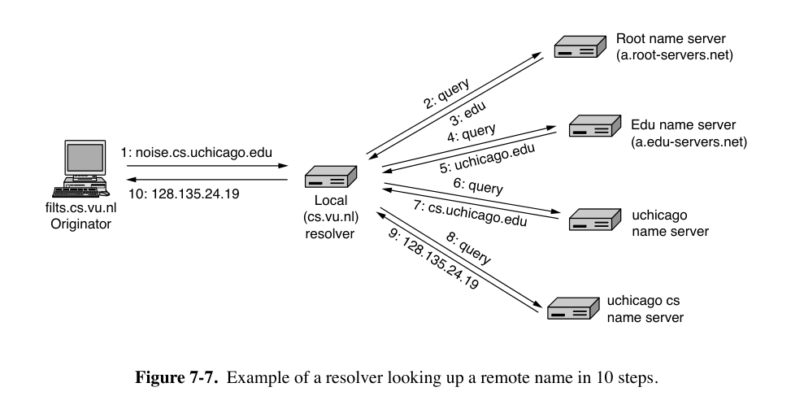

# 7: Application Layer

## 7.1 DNS

- DNS（Domain Name System，域名系统）
- 将域名映射到IP地址

### 7.1.1 DNS Lookup Process

- DNS将域名映射到IP地址的过程如下。
    - 应用程序调用一个库过程（被称为 stub resolver 存根解析器，通常是`gethostbyname`或其等效函数），并将域名作为参数传递给该函数。
    - stub resolver 将包含域名的查询发送到本地DNS解析器（通常称为 local recursive resolver 本地递归解析器 或简称 local resolver 本地解析器），后者随后对一组DNS解析器执行所谓的recursive lookup（递归查询）以查找该域名。
        - local resolver 会向域名各个层级的相应的 name server（被称为该域的 authoritative name server 权威名称服务器）发出查询
    - local recursive resolver 最终将包含相应IP地址的响应返回给 stub resolver，存根解析器再将结果传递给最初发出查询的函数。
- 查询和响应消息以UDP数据包的形式发送。
- DNS name server hierarchy
    - local resolver 不会只返回一部分答案。
    - root name server（以及后续的每个名称服务器）不会为 local name server 递归查询
    - local resolver 通过进一步发出 iterative queries 来继续解析。
- local server 域中的主机不需要被配置为一个有完整域名的服务器，能访问 local resolver 即可。
- 每次查询包含一个 16-bit transaction identifier（事务标识符），包含在响应中。
    - 用于让 name server 将查询映射到响应。
- caching：每个 answer都会被缓存
    - 每个 DNS resource record 中都包含 TTL（Time to live）。
- DNS的查询格式
    - 包括被查询的名称（QNAME），以及事务标识符等其它复制信息
    - 事务标识符最初只有16位，查询和响应没有加密，导致 cache poisoning attack 等各种攻击
        - 使用 0x20 encoding 来防御缓存投毒攻击。
    - QNAME minimization：本地解析器只发送查询中相应 authoritative name server 能够解析的部分，而不是FQDN（fully qualified domain name，完全限定域名）

### 7.1.2 The DNS Name Space and Hierarchy

- 域名 hierarchy（层次结构）的顶层由ICANN（Internet Corporation for Assigned Names and Numbers）负责。

    - 分为 gTLD（generic Top Level Domain，通用域名）与 ccTLD（country code Top Level Domain，国家域名）

    - 现在 gTLD 可以选择任意顶级域名，包括非拉丁字符。

- 二级域名的获取由 registries（注册局）负责

- 再下一级，registrars（注册商）直接向用户销售域名。

- 域名层次结构的每一层用`.`分隔。

    - 从技术上讲，所有FQDN都以`.`结尾，表示DNS层次结构的根，但大多数操作系统会自动补全这一部分。
        - 以句点结束的称为 absolute domain name，否则为 relative domain name。
    - 每个域名通过从它到根的路径向上命名。

- 域名不分大小写（case-insensitive）

- 域名的每个 component name 最多可以有63个字符，完整路径名称不得超过255个字符。

- 要创建一个新域名，需要获得其所在域名的许可。一旦创建并注册了新域名，无需从树的更高层获得任何人的许可即可创建子域名。

### 7.1.3 DNS Queries and Responses

- DNS Queries
    - 最常见的称为 A record query，要求将域名映射到相应互联网端点的IP地址。
    - DNS可以用于查找 DNSBL (DNS-based blacklist) 中的域名。
        - 客户端需要向特殊DNS服务器（如`pbl.spamhaus.org`，一个 policy blacklist）发送 A record query
        - 要查找特定IP地址，客户端只需反转IP地址的八位字节，并将结果添加到`pbl.spamhaus.org`前面。例如，要查找`127.0.0.2`，客户端只需发出对`2.0.0.127.pbl.spamhaus.org`的查询。
        - 如果相应的IP地址在列表中，DNS查询将返回一个IP地址，该地址通常编码一些附加信息.
        - 如果不在，返回相应的NXDOMAIN响应。

- Extensions and Enhancements to DNS Queries

    - EDNS0 CS Extended DNS Client Subnet（EDNS Client Subnet，EDNS0 CS）
        - local recursive resolver 将 stub resolver 的 IP address subnet 发送给 authoritative name server，让它看到发起查询的客户端的IP子网。
    - 0x20 encoding: local recursive server 会切换QNAME中每个字符的大小写，用域名中的每个字母的大小写为 DNS transaction identifier 编码一个额外的位。
        - 其他解析器不应在后续的迭代查询或响应中更改QNAME的大小写。

- DNS Responses and Resource Records

    - 在 DNS database 中，对每个域名关联IP地址之外的信息。

    - 每个 resource record 是一个 five-tuple：`Domain_name Time_to_live Class Type Value`

        - 域名：作为 primary search key
        
        - TTL：对于不同稳定性的域名，分配不同的生成时间
        
        - Class：对于互联网信息，它始终是IN。
        
        - Type与对应的Value字段存储的内容：见下图。
        
            
        
            - SOA record 提供了 name server 所在区域的 primary source of information 的名称、管理员的电子邮件地址、唯一的 serial number 以及各种标志和超时。
            - A record（Address）：某个主机的接口的32位IPv4地址。
            - AAAA record（quad A）：128位的IPv6地址。
                - DNS解析器可能会为一个域名返回多个IP地址。
        
            - NS record（Name Server）：指定域名或子域的 name server。
                - name server 是一个拥有域名数据库副本的主机
        
            - MX record（Mail Exchange）：根据email地址的域名寻找该网站的邮件服务器
            - CNAME record（Canonical Name）：记录网站别名
                - record 举例：`www.cs.uchicago.edu 120 IN CNAME hnd.cs.uchicago.edu`
        
            - PTR record（Pointer）指向另一个域名，用于将IP地址与相应的名称关联起来
                - 将名称与相应IP地址关联的PTR查找通常称为 reverse lookups（反向查找）
        
            - SRV record 允许为域中的给定服务标识主机。
                - 类似于 MX record，但MX只用于邮件
        
            - SPF record（Sender Policy Framework）：在域名中编码关于哪些机器可以向互联网的其他部分发送邮件的信息。
                - 举例：从自称dodgy的机器接收邮件，但域名记录表明邮件只能由名为smtp的机器发送，那么这封邮件很可能是伪造的垃圾邮件。
        
            - TXT record 最初是为了允许域名以任意方式 identify 自己。如今，它们通常编码机器可读的信息，通常是SPF信息。
        
    
- DNSSEC Records

    - DNSSEC record 在 DNS name server 的响应中携带数字签名，local / stub resolver 可以验证这些签名，以确保 DNS record 未被篡改。
    - 每个DNS服务器使用其私钥计算每组 resource records 的 RRSET（Resource Record Set）的哈希值。相应的公钥可用于验证RRSET上的签名。
    - 每个主机当然需要保证这个公钥的真实性，因此需要父名称服务器给权威名称服务器的公钥签名。举例来说，`.edu`的权威名称服务器给`.chicago.edu`的权威名称服务器的公钥签名。
    - DNSSEC有两个与公钥相关的资源记录：
        - (1) RRSIG记录，对应于使用相应权威名称服务器私钥签名的RRSET的签名。
        - (2) DNSKEY记录，是相应RRSET的公钥，由父服务器的私钥签名。
    - 只有 root-level public keys 必须以 out-of-band 的形式分发。

- DNS Zones

    - DNS resource record 的 database，称为 DNS zone file 或者 DNS zone

        

    - 单个name server可以包含整个DNS database，但是它一宕机服务可能就挂了。

        - 将 DNS name space 分为 nonoverlapping zones

            

- Name Resolution（域名解析）

    - 查找域名并找到IP地址的过程。

    - 如果 resolver 对某个域名有对应 record，回将查询结果返回、

        - 如果所查询的域名属于该 name server 的管辖范围，它将返回 authoritative record
            - 例如`top.cs.vu.nl`属于`cs.vu.nl`
            - authoritative record 一定是正确的，cached record 则不一定。

    - 如果域名是 remote 的，没有本地滑轮，则 name server 开始 remote query，流程见下图。

        - 有13个 root DNS server，对它们的查询通过 anycast routing 传递到离目标地址的最近实例。（注：anycast routing 任播 在考试范围表中标为不考。）

        

