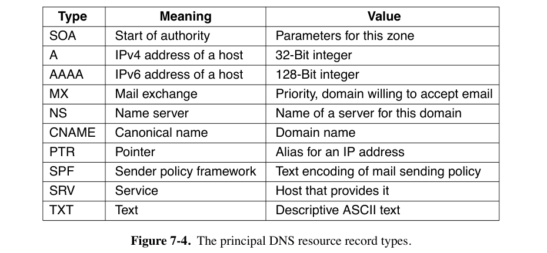
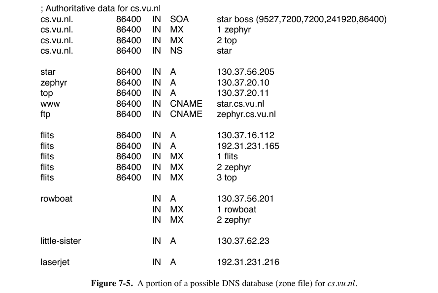
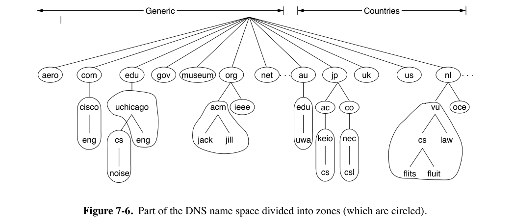
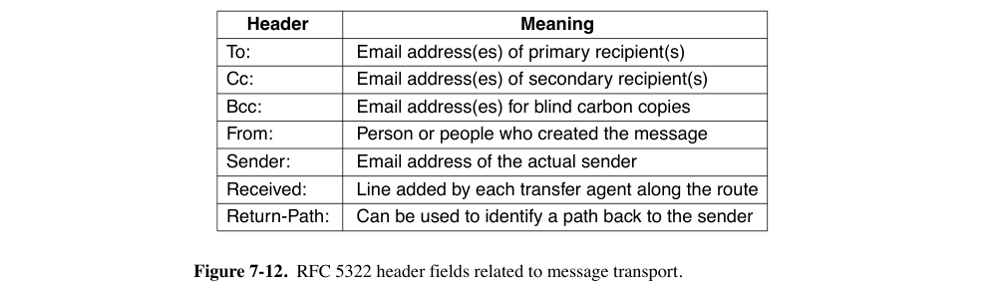
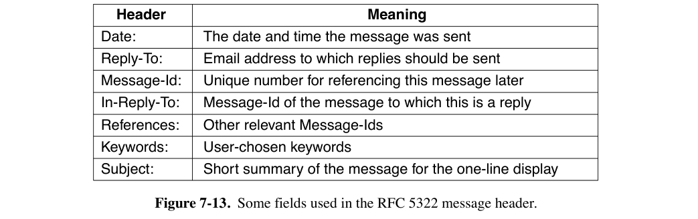
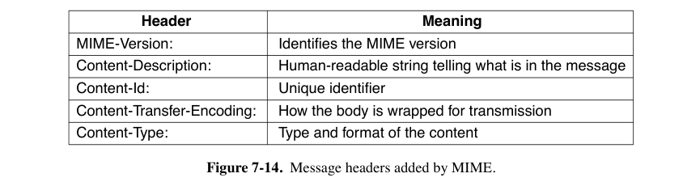
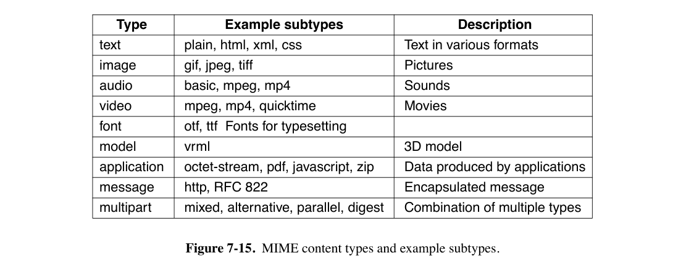

# 7: Application Layer

## 7.1 DNS

- DNS（Domain Name System，域名系统）
- 将域名映射到IP地址

### 7.1.1 DNS Lookup Process

- DNS将域名映射到IP地址的过程如下。
    - 应用程序调用一个库过程（被称为 stub resolver 存根解析器，通常是`gethostbyname`或其等效函数），并将域名作为参数传递给该函数。
    - stub resolver 将包含域名的查询发送到本地DNS解析器（通常称为 local recursive resolver 本地递归解析器 或简称 local resolver 本地解析器），后者随后对一组DNS解析器执行所谓的recursive lookup（递归查询）以查找该域名。
        - local resolver 会向域名各个层级的相应的 name server（被称为该域的 authoritative name server 权威名称服务器）发出查询
    - local recursive resolver 最终将包含相应IP地址的响应返回给 stub resolver，存根解析器再将结果传递给最初发出查询的函数。
- 查询和响应消息以UDP数据包的形式发送。
- DNS name server hierarchy
    - local resolver 不会只返回一部分答案。
    - root name server（以及后续的每个名称服务器）不会为 local name server 递归查询
    - local resolver 通过进一步发出 iterative queries 来继续解析。
- local server 域中的主机不需要被配置为一个有完整域名的服务器，能访问 local resolver 即可。
- 每次查询包含一个 16-bit transaction identifier（事务标识符），包含在响应中。
    - 用于让 name server 将查询映射到响应。
- caching：每个 answer都会被缓存
    - 每个 DNS resource record 中都包含 TTL（Time to live）。
- DNS的查询格式
    - 包括被查询的名称（QNAME），以及事务标识符等其它复制信息
    - 事务标识符最初只有16位，查询和响应没有加密，导致 cache poisoning attack 等各种攻击
        - 使用 0x20 encoding 来防御缓存投毒攻击。
    - QNAME minimization：本地解析器只发送查询中相应 authoritative name server 能够解析的部分，而不是FQDN（fully qualified domain name，完全限定域名）

### 7.1.2 The DNS Name Space and Hierarchy

- 域名 hierarchy（层次结构）的顶层由ICANN（Internet Corporation for Assigned Names and Numbers）负责。

    - 分为 gTLD（generic Top Level Domain，通用域名）与 ccTLD（country code Top Level Domain，国家域名）

    - 现在 gTLD 可以选择任意顶级域名，包括非拉丁字符。

- 二级域名的获取由 registries（注册局）负责

- 再下一级，registrars（注册商）直接向用户销售域名。

- 域名层次结构的每一层用`.`分隔。

    - 从技术上讲，所有FQDN都以`.`结尾，表示DNS层次结构的根，但大多数操作系统会自动补全这一部分。
        - 以句点结束的称为 absolute domain name，否则为 relative domain name。
    - 每个域名通过从它到根的路径向上命名。

- 域名不分大小写（case-insensitive）

- 域名的每个 component name 最多可以有63个字符，完整路径名称不得超过255个字符。

- 要创建一个新域名，需要获得其所在域名的许可。一旦创建并注册了新域名，无需从树的更高层获得任何人的许可即可创建子域名。

### 7.1.3 DNS Queries and Responses

- DNS Queries
    - 最常见的称为 A record query，要求将域名映射到相应互联网端点的IP地址。
    - DNS可以用于查找 DNSBL (DNS-based blacklist) 中的域名。
        - 客户端需要向特殊DNS服务器（如`pbl.spamhaus.org`，一个 policy blacklist）发送 A record query
        - 要查找特定IP地址，客户端只需反转IP地址的八位字节，并将结果添加到`pbl.spamhaus.org`前面。例如，要查找`127.0.0.2`，客户端只需发出对`2.0.0.127.pbl.spamhaus.org`的查询。
        - 如果相应的IP地址在列表中，DNS查询将返回一个IP地址，该地址通常编码一些附加信息.
        - 如果不在，返回相应的NXDOMAIN响应。

- Extensions and Enhancements to DNS Queries

    - EDNS0 CS Extended DNS Client Subnet（EDNS Client Subnet，EDNS0 CS）
        - local recursive resolver 将 stub resolver 的 IP address subnet 发送给 authoritative name server，让它看到发起查询的客户端的IP子网。
    - 0x20 encoding: local recursive server 会切换QNAME中每个字符的大小写，用域名中的每个字母的大小写为 DNS transaction identifier 编码一个额外的位。
        - 其他解析器不应在后续的迭代查询或响应中更改QNAME的大小写。

- DNS Responses and Resource Records

    - 在 DNS database 中，对每个域名关联IP地址之外的信息。

    - 每个 resource record 是一个 five-tuple：`Domain_name Time_to_live Class Type Value`

        - 域名：作为 primary search key
        
        - TTL：对于不同稳定性的域名，分配不同的生成时间
        
        - Class：对于互联网信息，它始终是IN。
        
        - Type与对应的Value字段存储的内容：见下图。
        
            
        
            - SOA record 提供了 name server 所在区域的 primary source of information 的名称、管理员的电子邮件地址、唯一的 serial number 以及各种标志和超时。
            - A record（Address）：某个主机的接口的32位IPv4地址。
            - AAAA record（quad A）：128位的IPv6地址。
                - DNS解析器可能会为一个域名返回多个IP地址。
        
            - NS record（Name Server）：指定域名或子域的 name server。
                - name server 是一个拥有域名数据库副本的主机
        
            - MX record（Mail Exchange）：根据email地址的域名寻找该网站的邮件服务器
            - CNAME record（Canonical Name）：记录网站别名
                - record 举例：`www.cs.uchicago.edu 120 IN CNAME hnd.cs.uchicago.edu`
        
            - PTR record（Pointer）指向另一个域名，用于将IP地址与相应的名称关联起来
                - 将名称与相应IP地址关联的PTR查找通常称为 reverse lookups（反向查找）
        
            - SRV record 允许为域中的给定服务标识主机。
                - 类似于 MX record，但MX只用于邮件
        
            - SPF record（Sender Policy Framework）：在域名中编码关于哪些机器可以向互联网的其他部分发送邮件的信息。
                - 举例：从自称dodgy的机器接收邮件，但域名记录表明邮件只能由名为smtp的机器发送，那么这封邮件很可能是伪造的垃圾邮件。
        
            - TXT record 最初是为了允许域名以任意方式 identify 自己。如今，它们通常编码机器可读的信息，通常是SPF信息。
        
    
- DNSSEC Records

    - DNSSEC record 在 DNS name server 的响应中携带数字签名，local / stub resolver 可以验证这些签名，以确保 DNS record 未被篡改。
    - 每个DNS服务器使用其私钥计算每组 resource records 的 RRSET（Resource Record Set）的哈希值。相应的公钥可用于验证RRSET上的签名。
    - 每个主机当然需要保证这个公钥的真实性，因此需要父名称服务器给权威名称服务器的公钥签名。举例来说，`.edu`的权威名称服务器给`.chicago.edu`的权威名称服务器的公钥签名。
    - DNSSEC有两个与公钥相关的资源记录：
        - (1) RRSIG记录，对应于使用相应权威名称服务器私钥签名的RRSET的签名。
        - (2) DNSKEY记录，是相应RRSET的公钥，由父服务器的私钥签名。
    - 只有 root-level public keys 必须以 out-of-band 的形式分发。

- DNS Zones

    - DNS resource record 的 database，称为 DNS zone file 或者 DNS zone

        

    - 单个name server可以包含整个DNS database，但是它一宕机服务可能就挂了。

        - 将 DNS name space 分为 nonoverlapping zones

            

- Name Resolution（域名解析）

    - 查找域名并找到IP地址的过程。

    - 如果 resolver 对某个域名有对应 record，回将查询结果返回、

        - 如果所查询的域名属于该 name server 的管辖范围，它将返回 authoritative record
            - 例如`top.cs.vu.nl`属于`cs.vu.nl`
            - authoritative record 一定是正确的，cached record 则不一定。

    - 如果域名是 remote 的，没有本地滑轮，则 name server 开始 remote query，流程见下图。

        - 有13个 root DNS server，对它们的查询通过 anycast routing 传递到离目标地址的最近实例。（注：anycast routing 任播 在考试范围表中标为不考。）

        

## 7.2 Electronical Mail

- 电子邮件系统目前已经与文件传输协议分离。
- 邮件系统分为两部分：
    - user agent（用户代理）允许人们阅读和发送电子邮件
        - 发送邮件的动作称为 mail submission。
        - 不会直接显示 message field 的原始内容，而是作了用户友好化处理。
        - message disposition（消息处置）：删除、回复、转发等。
        - 可以自动进行 filing（归档）操作，比如垃圾邮件、收件箱等。
            - 垃圾邮件可能来自 botnet（僵尸网络）
    - message transfer agents（消息传输代理，也称 mail server）负责将消息从发送方传输到接收方。
        - 为系统进程
        - SMTP（Simple Mail Transfer Protocol）：将邮件从 originator 移动到 recipient。
            - 必须报告 delivery status。
        - 包含 mailing list（即群发列表）等高级功能。
- mailbox 由 mail servers 维护。
    - user agent 可以向 mail servers 发送命令操作邮箱。
- 电子邮件在消息传输代理之间以某种标准格式发送。
- envelope 封装了消息并包含传输所需的信息，消息传输代理也使用信封的信息进行路由。
    - 信封内的消息由 header 与 body 组成。
        - 头部包含 user agent 的控制信息。
        - 正文完全是为人类收件人准备的，代理程序并不太关心它。

### 7.2.1 Message Formats

- RFC 5322 The Internet Message Format

    - 基于RFC 822，并未明确区分信封字段和头字段。

    - 消息由一个primitive envelope、一些header fields（头字段）、一个blank line，然后是消息正文组成。

        - 每个header field（逻辑上）由一行ASCII文本组成，包含field name、colon（冒号）以及（大多数字段都有的）字段的值。

    - 下图中为消息传输相关的主要头字段。

        - Cc：Carbon copy，抄送

        - Bcc：Blind carbon copy，密送

        - 每经过一个 message transfer agent，都要加一行 Received 字段。

        - Return-Path 字段由最后一个 message transfer agent 添加。

            

    - 还有一些主要供人类阅读的字段。

        - Reply-to：用于告知收件人有事不要给发件人发邮件，要给这个字段这个人回复。

        - Message-Id：自动生成的数据，用于消息之间相互引用。

        - RFCC 5322明确允许用户自己创造头字段，要以`X-`开头。

            

    - 后面是 message body，用户可以在这里填写任何内容。

- MIME The Multipurpose Internet Mail Extensions RFC 2045

    - 继续使用RFC 822格式，但在消息正文中添加结构，并为非ASCII消息的传输定义编码规则。

    - 添加了5个新的消息头字段。

        

        - 任何不包含MIME-Version头字段的消息都被视为使用ASCII字符的消息处理
        - Content-Description：是ASCII字符串，为必需字段，说明消息中包含什么内容。
        - Content-Id：格式与Message-Id一致。
        - Content-Transfer-Encoding：表示消息正文如何编码。有5种。
            1. 每行不超过1000个每个7bit的ASCII字符
            2. 每行不超过1000个8位编码的的字符
            3. 二进制编码，不限制长度
                - 对于不支持二进制数据的mail server，将二进制数据用 ASCII 编码（base64 MIME）
                    - 24位组被分解为四个6位单元，每个单元作为合法的ASCII字符发送。
                    - 编码为A表示0，B表示1，依此类推，接着是小写字母、10个数字，最后是+和/分别表示62和63。==和=序列表示最后一组分别只包含8或16位。回车符和换行符被忽略。
                    - 可以安全发送任意二进制文本

        - Content-Type

            

### 7.2.2 Message Transfer

- SMTP (Simple Mail Transfer Protocol) and Extensions
    - 包括mail submission和在消息传输代理之间传输消息两种用途。
        - final delivery 不使用SMTP
    - mail server 使用SMTP监听 TCP port 25 来进行 delivery（交付）
        - 该服务器接受 incoming connections（经过一些安全检查），并接受消息以进行交付。
        - 如果消息无法交付，则会向发送方返回一个包含不可交付消息前部分的错误报告。
    - SMTP是一个简单的ASCII协议。
    - mail server 之间的传输流程
        - 在建立到端口25的TCP连接后，发送方（客户端）等待接收方（服务器）首先发言。
        - 服务器首先发送一行文本，给出其身份并告知是否准备好接收邮件。
            - 如果它不准备接收邮件，客户端将释放连接并稍后重试。
            - 如果服务器愿意接收电子邮件，客户端会宣布电子邮件的发送方和接收方。
        - 如果目的地存在这样的收件人，服务器会通知客户端可以发送消息。
        - 然后客户端发送消息，服务器确认接收。
            - 不需要校验和，因为TCP提供了可靠的字节流。
        - 当所有电子邮件在两个方向上交换完毕后，连接将被释放。
    - 具体对话（此处从略）
        - 所有命令都必须有四个字符，原因不明
        - 客户端的第一个命令是HELO
        - 可以使用多个RCPT命令将单个消息发送给多个接收者。
            - 即使发给某些接收者的请求因为找不到目的地而被拒绝，消息也可以发送给其他接收者。
    - 缺陷：
        - 不包括身份验证
        - 不能传输二进制数据。因此引入了base64 MIME。
        - SMTP以明文发送消息。
    - ESMTP（扩展SMTP）
        - 如果希望扩展，客户端第一个消息改为EHLO而不是HELO
            - 如果被拒绝，说明服务器是一个常规的SMTP服务器，客户端应按普通方式传输。
            - 如果EHLO被接受，服务器会回复它支持的扩展。
- Mail Submission
    - SMTP通常与AUTH扩展一起用于邮件提交。此扩展允许服务器检查客户端的凭据（用户名和密码），以确认服务器应提供邮件服务。
    - SMTP服务器可以检查和纠正用户代理发送的消息的格式。
    - 在使用SMTP提交时，可以使用端口587而不是端口25。
- Physical Transfer
    - 根据邮件地址寻找正确的目标邮件服务器的过程：
        - 查询DNS。例如，向`compnet@zju.edu.cn`发送邮件，应查询`zju.edu.cn`的MX记录
        - 发送邮件传输代理在端口25上建立到邮件服务器IP地址的TCP连接，以到达接收邮件传输代理，并使用SMTP relay（中继）消息。
        - 可能会在邮件服务器间多次跳转，如设置为自动转发或者mailind list群发。